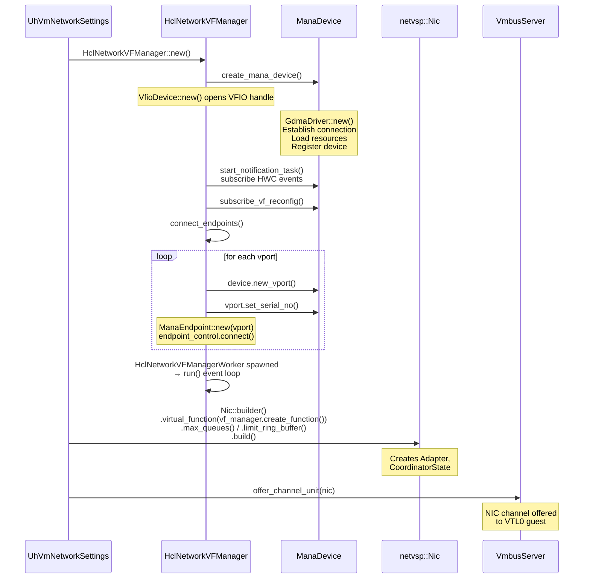
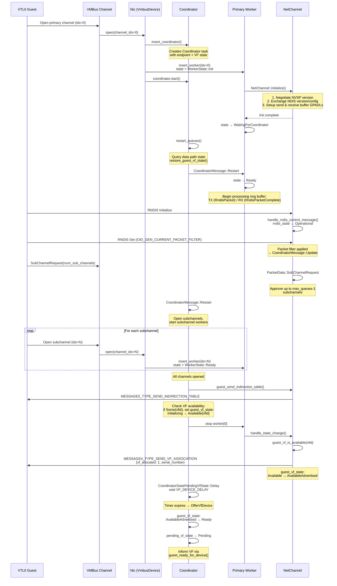
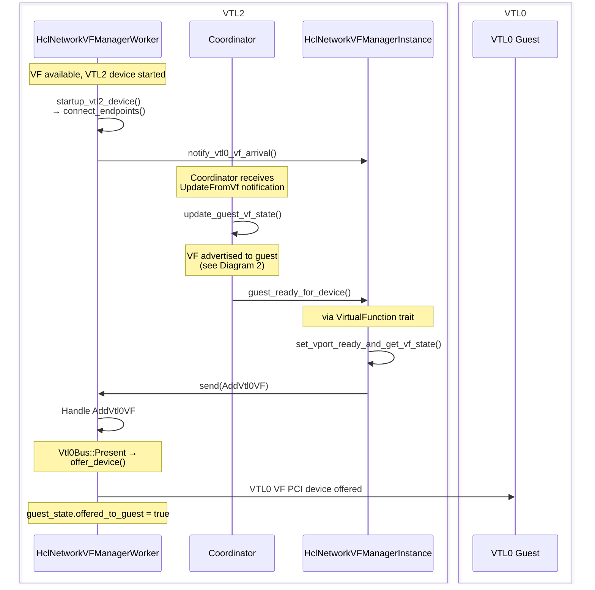
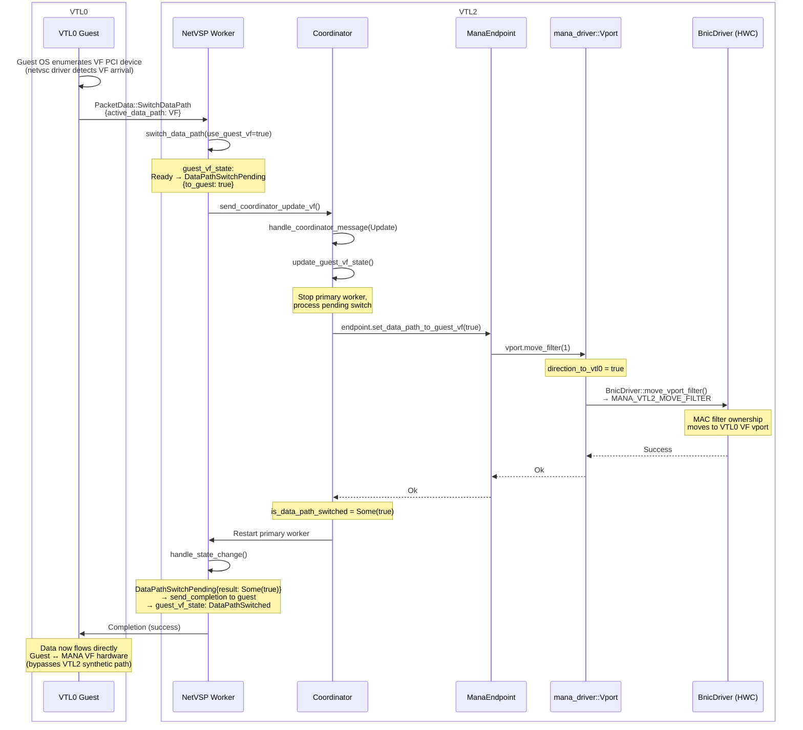
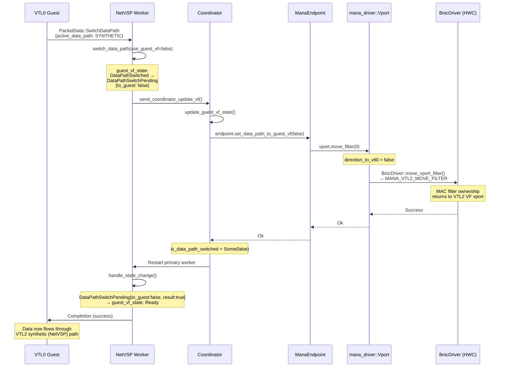
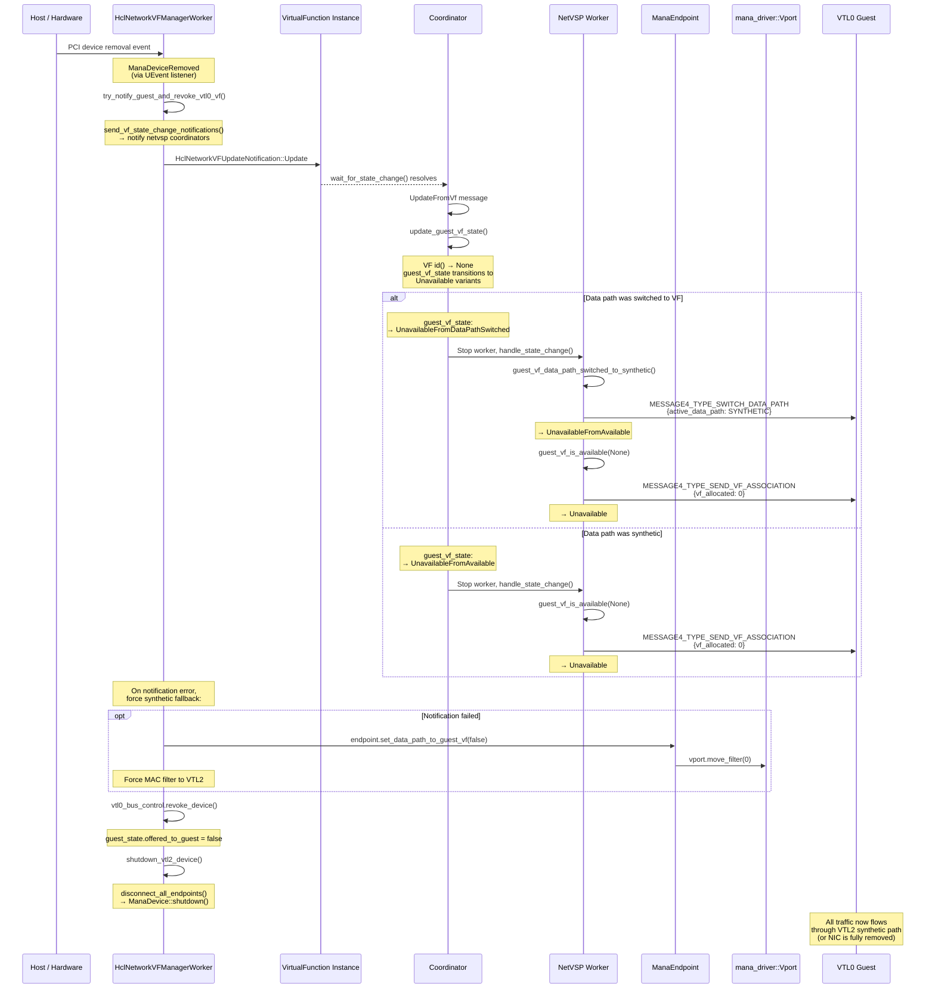
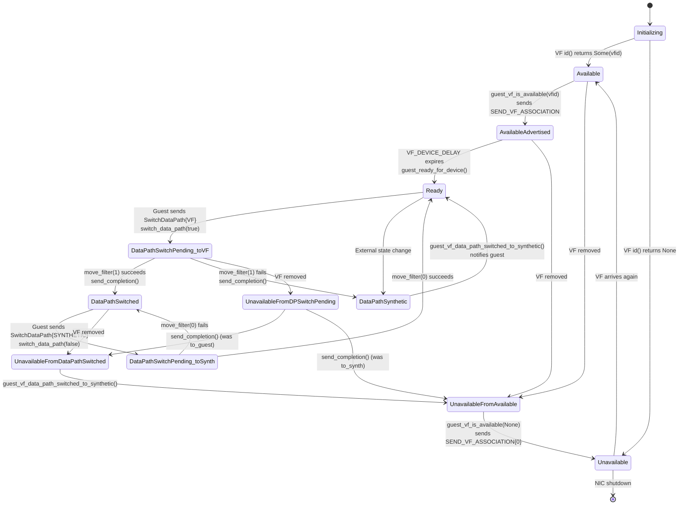

# NetVSP & MANA NIC Lifecycle Diagrams

This document describes the lifecycle of the NetVSP synthetic NIC and the
MANA hardware NIC, from VTL2 boot through VF data-path switching and
teardown. Each diagram calls out the key functions involved.

## 1. VTL2 Startup & MANA Initialization

As the OpenHCL kernel boots, it runs `/underhill-init` as its PID0 process; `underhill-init` then spins up processes to serve the various functions of the firmware. `openvmm_hcl` spawns worker tasks for each of the services it offers; for NICs, it creates a separate instance of `HclNetworkVFManager` for each one attached via `HclNetworkVfManager::new`. The diagram picks up here: `HclNetworkVFManager` then creates a `ManaDevice` object, and once _that_ has finished setting up `GdmaDriver`, the VFManager establishes VPorts for all available endpoints. At this point, `UhVmNetworkSettings` offers the NIC to the VTL0 guest.

### Components

| Diagram Name | Crate Path | Role |
|---|---|---|
| UhVmNetworkSettings | `underhill_core::worker::UhVmNetworkSettings` | Orchestrates NIC creation in Underhill |
| HclNetworkVFManager | `underhill_core::emuplat::netvsp::HclNetworkVFManager` | Manages MANA VF lifecycle |
| ManaDevice | `mana_driver::mana::ManaDevice` | MANA NIC device abstraction |
| netvsp::Nic | `netvsp::Nic` | Synthetic NIC VMBus device |
| VmbusServer | `vmm_core::vmbus_unit` / `vmbus_server::VmbusServer` | VMBus channel management |

### Citations

| Diagram Action | Source |
|---|---|
| `HclNetworkVFManager::new()` | [`HclNetworkVFManager::new` in netvsp.rs @ 1462](https://github.com/microsoft/openvmm/blob/main/openhcl/underhill_core/src/emuplat/netvsp.rs#L1462) |
| `create_mana_device()` | [`create_mana_device` in netvsp.rs @ 79](https://github.com/microsoft/openvmm/blob/main/openhcl/underhill_core/src/emuplat/netvsp.rs#L79) |
| `VfioDevice::new()` | [`VfioDevice::new` in vfio.rs @ 91](https://github.com/microsoft/openvmm/blob/main/vm/devices/user_driver/src/vfio.rs#L91) |
| `GdmaDriver::new()` | [`GdmaDriver::new` in gdma_driver.rs @ 285](https://github.com/microsoft/openvmm/blob/main/vm/devices/net/mana_driver/src/gdma_driver.rs#L285) |
| `start_notification_task()` | [`ManaDevice::start_notification_task` in mana.rs @ 208](https://github.com/microsoft/openvmm/blob/main/vm/devices/net/mana_driver/src/mana.rs#L208) |
| `subscribe_vf_reconfig()` | [`ManaDevice::subscribe_vf_reconfig` in mana.rs @ 289](https://github.com/microsoft/openvmm/blob/main/vm/devices/net/mana_driver/src/mana.rs#L289) |
| `connect_endpoints()` | [`HclNetworkVFManagerWorker::connect_endpoints` in netvsp.rs @ 380](https://github.com/microsoft/openvmm/blob/main/openhcl/underhill_core/src/emuplat/netvsp.rs#L380) |
| `device.new_vport()` | [`ManaDevice::new_vport` in mana.rs @ 254](https://github.com/microsoft/openvmm/blob/main/vm/devices/net/mana_driver/src/mana.rs#L254) |
| `vport.set_serial_no()` | [`Vport::set_serial_no` in mana.rs @ 546](https://github.com/microsoft/openvmm/blob/main/vm/devices/net/mana_driver/src/mana.rs#L546) |
| `ManaEndpoint::new(vport)` | [`ManaEndpoint::new` in lib.rs (net_mana) @ 122](https://github.com/microsoft/openvmm/blob/main/vm/devices/net/net_mana/src/lib.rs#L122) |
| `endpoint_control.connect()` | [`HclNetworkVFManagerWorker::connect_endpoints` in netvsp.rs @ 413](https://github.com/microsoft/openvmm/blob/main/openhcl/underhill_core/src/emuplat/netvsp.rs#L413) |
| `HclNetworkVFManagerWorker::run()` | [`HclNetworkVFManagerWorker::run` in netvsp.rs @ 714](https://github.com/microsoft/openvmm/blob/main/openhcl/underhill_core/src/emuplat/netvsp.rs#L714) |
| `Nic::builder()` | [`Nic::builder` in lib.rs (netvsp) @ 1217](https://github.com/microsoft/openvmm/blob/main/vm/devices/net/netvsp/src/lib.rs#L1217) |
| `NicBuilder::build()` | [`NicBuilder::build` in lib.rs (netvsp) @ 1091](https://github.com/microsoft/openvmm/blob/main/vm/devices/net/netvsp/src/lib.rs#L1091) |
| `offer_channel_unit(nic)` | [`offer_channel_unit` in vmbus_unit.rs @ 112](https://github.com/microsoft/openvmm/blob/main/vmm_core/src/vmbus_unit.rs#L112) |

## 2. Adding a Virtual NIC to the VTL0 Guest

Once the VMBus channel is offered, the VTL0 guest opens it and negotiates
the NVSP protocol, sets up ring buffers and RNDIS, and receives the VF
association advertisement.

### Components

| Diagram Name | Crate Path | Role |
|---|---|---|
| VTL0 Guest | _(external)_ | VTL0 guest OS |
| VMBus Channel | `vmbus_server::VmbusServer` | VMBus transport |
| Nic (VmbusDevice) | `netvsp::Nic` (`VmbusDevice` impl) | NetVSP device — open / close / start / stop |
| Coordinator | `netvsp::Coordinator` | Coordinates VF state and worker lifecycle |
| Primary Worker | `netvsp::Worker` | Processes ring buffer I/O on primary channel |
| NetChannel | `netvsp::NetChannel` | NVSP protocol negotiation and RNDIS handling |

### Citations

| Diagram Action | Source |
|---|---|
| `open(channel_idx=0)` | [`Nic::open` in lib.rs (netvsp) @ 1264](https://github.com/microsoft/openvmm/blob/main/vm/devices/net/netvsp/src/lib.rs#L1264) |
| `insert_coordinator()` | [`Nic::insert_coordinator` in lib.rs (netvsp) @ 1494](https://github.com/microsoft/openvmm/blob/main/vm/devices/net/netvsp/src/lib.rs#L1494) |
| `insert_worker(idx=0)` | [`Nic::insert_worker` in lib.rs (netvsp) @ 1430](https://github.com/microsoft/openvmm/blob/main/vm/devices/net/netvsp/src/lib.rs#L1430) |
| `coordinator.start()` | [`Nic::start` in lib.rs (netvsp) @ 1382](https://github.com/microsoft/openvmm/blob/main/vm/devices/net/netvsp/src/lib.rs#L1382) |
| `NetChannel::initialize()` | [`NetChannel::initialize` in lib.rs (netvsp) @ 4805](https://github.com/microsoft/openvmm/blob/main/vm/devices/net/netvsp/src/lib.rs#L4805) |
| `restart_queues()` | [`Coordinator::restart_queues` in lib.rs (netvsp) @ 4413](https://github.com/microsoft/openvmm/blob/main/vm/devices/net/netvsp/src/lib.rs#L4413) |
| `restore_guest_vf_state()` | [`Coordinator::restore_guest_vf_state` in lib.rs (netvsp) @ 4195](https://github.com/microsoft/openvmm/blob/main/vm/devices/net/netvsp/src/lib.rs#L4195) |
| `CoordinatorMessage::Restart` | [`enum CoordinatorMessage` in lib.rs (netvsp) @ 156](https://github.com/microsoft/openvmm/blob/main/vm/devices/net/netvsp/src/lib.rs#L156) |
| `handle_rndis_control_message()` | [`NetChannel::handle_rndis_control_message` in lib.rs (netvsp) @ 2869](https://github.com/microsoft/openvmm/blob/main/vm/devices/net/netvsp/src/lib.rs#L2869) |
| `PacketData::SubChannelRequest` | [`Worker::process` in lib.rs (netvsp) @ 5480](https://github.com/microsoft/openvmm/blob/main/vm/devices/net/netvsp/src/lib.rs#L5480) |
| `guest_send_indirection_table()` | [`NetChannel::guest_send_indirection_table` in lib.rs (netvsp) @ 2677](https://github.com/microsoft/openvmm/blob/main/vm/devices/net/netvsp/src/lib.rs#L2677) |
| `guest_vf_is_available(vfid)` | [`NetChannel::guest_vf_is_available` in lib.rs (netvsp) @ 2623](https://github.com/microsoft/openvmm/blob/main/vm/devices/net/netvsp/src/lib.rs#L2623) |
| `MESSAGE4_TYPE_SEND_VF_ASSOCIATION` | [`Message4SendVfAssociation` in protocol.rs @ 446](https://github.com/microsoft/openvmm/blob/main/vm/devices/net/netvsp/src/protocol.rs#L446) |
| `handle_state_change()` | [`Worker::handle_state_change` in lib.rs (netvsp) @ 2767](https://github.com/microsoft/openvmm/blob/main/vm/devices/net/netvsp/src/lib.rs#L2767) |
| `guest_ready_for_device()` | [`VirtualFunction::guest_ready_for_device` in lib.rs (netvsp) @ 336](https://github.com/microsoft/openvmm/blob/main/vm/devices/net/netvsp/src/lib.rs#L336) |

## 3. VF Data Path Switch: Synthetic → VF (Accelerated Networking)

When the guest is ready and the VF hardware is available, the data path
switches from the synthetic NetVSP path through VTL2 to direct VF
passthrough to the VTL0 guest. This procedure has been divided into two diagrams, since the halves of the operation involve mostly independent components.

### Components

| Diagram Name | Crate Path | Role |
|---|---|---|
| HclNetworkVFManagerWorker | `underhill_core::emuplat::netvsp::HclNetworkVFManagerWorker` | Event loop for VF lifecycle messages |
| Coordinator | `netvsp::Coordinator` | VF state coordinator |
| HclNetworkVFManagerInstance | `underhill_core::emuplat::netvsp::HclNetworkVFManagerInstance` | Per-NIC `VirtualFunction` trait impl |
| ManaEndpoint | `net_mana::ManaEndpoint` | Endpoint adapter for MANA VF operations |
| mana_driver::Vport | `mana_driver::mana::Vport` | MANA virtual port — filter ownership |
| BnicDriver (HWC) | `mana_driver::bnic_driver::BnicDriver` | Hardware command channel driver |
| NetVSP Worker | `netvsp::Worker` | Primary channel worker |
| VTL0 Guest | _(external)_ | VTL0 guest OS |

### 3a. MANA device arrives & VTL2 prepares

#### Citations

| Diagram Action | Source |
|---|---|
| `startup_vtl2_device()` | [`HclNetworkVFManagerWorker::startup_vtl2_device` in netvsp.rs @ 656](https://github.com/microsoft/openvmm/blob/main/openhcl/underhill_core/src/emuplat/netvsp.rs#L656) |
| `connect_endpoints()` | [`HclNetworkVFManagerWorker::connect_endpoints` in netvsp.rs @ 380](https://github.com/microsoft/openvmm/blob/main/openhcl/underhill_core/src/emuplat/netvsp.rs#L380) |
| `notify_vtl0_vf_arrival()` | [`HclNetworkVFManagerWorker::notify_vtl0_vf_arrival` in netvsp.rs @ 536](https://github.com/microsoft/openvmm/blob/main/openhcl/underhill_core/src/emuplat/netvsp.rs#L536) |
| `update_guest_vf_state()` | [`Coordinator::update_guest_vf_state` in lib.rs (netvsp) @ 4639](https://github.com/microsoft/openvmm/blob/main/vm/devices/net/netvsp/src/lib.rs#L4639) |
| `guest_ready_for_device()` (trait) | [`VirtualFunction::guest_ready_for_device` in lib.rs (netvsp) @ 336](https://github.com/microsoft/openvmm/blob/main/vm/devices/net/netvsp/src/lib.rs#L336) |
| `guest_ready_for_device()` (impl) | [`HclNetworkVFManagerInstance::guest_ready_for_device` in netvsp.rs @ 1753](https://github.com/microsoft/openvmm/blob/main/openhcl/underhill_core/src/emuplat/netvsp.rs#L1753) |
| `set_vport_ready_and_get_vf_state()` | [`HclNetworkVFManagerInstance` (field callback)` in netvsp.rs @ 1755](https://github.com/microsoft/openvmm/blob/main/openhcl/underhill_core/src/emuplat/netvsp.rs#L1755) |
| `send(AddVtl0VF)` | [`HclNetworkVfManagerMessage::AddVtl0VF` in netvsp.rs @ 1768](https://github.com/microsoft/openvmm/blob/main/openhcl/underhill_core/src/emuplat/netvsp.rs#L1768) |
| Handle `AddVtl0VF` → `offer_device()` | [`HclNetworkVFManagerWorker::run` match arm` in netvsp.rs @ 836](https://github.com/microsoft/openvmm/blob/main/openhcl/underhill_core/src/emuplat/netvsp.rs#L836) |
| `offer_device()` (VTL0 bus) | [`HclVpciBusControl::offer_device` in vpci.rs @ 53](https://github.com/microsoft/openvmm/blob/main/openhcl/underhill_core/src/vpci.rs#L53) |

### 3b. VTL0 accepts MANA VF & VTL2 switches data paths

#### Citations

| Diagram Action | Source |
|---|---|
| `PacketData::SwitchDataPath {VF}` | [`Message4SwitchDataPath` in protocol.rs @ 473](https://github.com/microsoft/openvmm/blob/main/vm/devices/net/netvsp/src/protocol.rs#L473) |
| `switch_data_path(true)` | [`Worker::switch_data_path` in lib.rs (netvsp) @ 5360](https://github.com/microsoft/openvmm/blob/main/vm/devices/net/netvsp/src/lib.rs#L5360) |
| `send_coordinator_update_vf()` | [`NetChannel::send_coordinator_update_vf` in lib.rs (netvsp) @ 3197](https://github.com/microsoft/openvmm/blob/main/vm/devices/net/netvsp/src/lib.rs#L3197) |
| `handle_coordinator_message(Update)` | [`Coordinator::handle_coordinator_message` in lib.rs (netvsp) @ 4144](https://github.com/microsoft/openvmm/blob/main/vm/devices/net/netvsp/src/lib.rs#L4144) |
| `set_data_path_to_guest_vf(true)` | [`ManaEndpoint::set_data_path_to_guest_vf` in lib.rs (net_mana) @ 541](https://github.com/microsoft/openvmm/blob/main/vm/devices/net/net_mana/src/lib.rs#L541) |
| `vport.move_filter(1)` | [`Vport::move_filter` in mana.rs @ 519](https://github.com/microsoft/openvmm/blob/main/vm/devices/net/mana_driver/src/mana.rs#L519) |
| `BnicDriver::move_vport_filter()` | [`BnicDriver::move_vport_filter` in bnic_driver.rs @ 239](https://github.com/microsoft/openvmm/blob/main/vm/devices/net/mana_driver/src/bnic_driver.rs#L239) |
| `handle_state_change()` | [`Worker::handle_state_change` in lib.rs (netvsp) @ 2767](https://github.com/microsoft/openvmm/blob/main/vm/devices/net/netvsp/src/lib.rs#L2767) |

## 4. VF Data Path Switch Back: VF → Synthetic (Failback)

This can happen due to guest-initiated switchback, VF removal (live
migration, servicing), or hardware reconfiguration. Two sub-flows
are shown.

### 4a. Guest-Initiated Switchback

#### Components

| Diagram Name | Crate Path | Role |
|---|---|---|
| VTL0 Guest | _(external)_ | VTL0 guest OS |
| NetVSP Worker | `netvsp::Worker` | Primary channel worker |
| Coordinator | `netvsp::Coordinator` | VF state coordinator |
| ManaEndpoint | `net_mana::ManaEndpoint` | Endpoint adapter |
| mana_driver::Vport | `mana_driver::mana::Vport` | MANA virtual port |
| BnicDriver (HWC) | `mana_driver::bnic_driver::BnicDriver` | HW command channel |

#### Citations

| Diagram Action | Source |
|---|---|
| `PacketData::SwitchDataPath {SYNTHETIC}` | [`Message4SwitchDataPath` / `DataPath` in protocol.rs @ 473 / 462](https://github.com/microsoft/openvmm/blob/main/vm/devices/net/netvsp/src/protocol.rs#L473) |
| `switch_data_path(false)` | [`Worker::switch_data_path` in lib.rs (netvsp) @ 5360](https://github.com/microsoft/openvmm/blob/main/vm/devices/net/netvsp/src/lib.rs#L5360) |
| `send_coordinator_update_vf()` | [`NetChannel::send_coordinator_update_vf` in lib.rs (netvsp) @ 3197](https://github.com/microsoft/openvmm/blob/main/vm/devices/net/netvsp/src/lib.rs#L3197) |
| `update_guest_vf_state()` | [`Coordinator::update_guest_vf_state` in lib.rs (netvsp) @ 4639](https://github.com/microsoft/openvmm/blob/main/vm/devices/net/netvsp/src/lib.rs#L4639) |
| `set_data_path_to_guest_vf(false)` | [`ManaEndpoint::set_data_path_to_guest_vf` in lib.rs (net_mana) @ 541](https://github.com/microsoft/openvmm/blob/main/vm/devices/net/net_mana/src/lib.rs#L541) |
| `vport.move_filter(0)` | [`Vport::move_filter` in mana.rs @ 519](https://github.com/microsoft/openvmm/blob/main/vm/devices/net/mana_driver/src/mana.rs#L519) |
| `BnicDriver::move_vport_filter()` | [`BnicDriver::move_vport_filter` in bnic_driver.rs @ 239](https://github.com/microsoft/openvmm/blob/main/vm/devices/net/mana_driver/src/bnic_driver.rs#L239) |
| `handle_state_change()` | [`Worker::handle_state_change` in lib.rs (netvsp) @ 2767](https://github.com/microsoft/openvmm/blob/main/vm/devices/net/netvsp/src/lib.rs#L2767) |

### 4b. VF Removal / Hardware Reconfiguration (Host-Initiated)

> [!NOTE]
> The filter-move sequence in the `opt` block above
> (`ManaEndpoint` → `Vport`) mirrors the full chain shown in
> Diagram 4a. See that diagram for the complete
> `set_data_path_to_guest_vf` → `move_filter` → `BnicDriver` flow.

#### Components

| Diagram Name | Crate Path | Role |
|---|---|---|
| Host / Hardware | _(external)_ | Physical host / NIC hardware |
| HclNetworkVFManagerWorker | `underhill_core::emuplat::netvsp::HclNetworkVFManagerWorker` | VF lifecycle event loop (receives UEvents) |
| VirtualFunction Instance | `underhill_core::emuplat::netvsp::HclNetworkVFManagerInstance` | Per-NIC `VirtualFunction` trait impl |
| Coordinator | `netvsp::Coordinator` | VF state coordinator |
| NetVSP Worker | `netvsp::Worker` | Primary channel worker |
| ManaEndpoint | `net_mana::ManaEndpoint` | Endpoint adapter (fallback path) |
| mana_driver::Vport | `mana_driver::mana::Vport` | MANA virtual port (fallback path) |
| VTL0 Guest | _(external)_ | VTL0 guest OS |

#### Citations

| Diagram Action | Source |
|---|---|
| PCI removal event (UEvent) | [`HclNetworkVFManagerWorker::run` in netvsp.rs @ 714](https://github.com/microsoft/openvmm/blob/main/openhcl/underhill_core/src/emuplat/netvsp.rs#L714) |
| `try_notify_guest_and_revoke_vtl0_vf()` | [`HclNetworkVFManagerWorker::try_notify_guest_and_revoke_vtl0_vf` in netvsp.rs @ 454](https://github.com/microsoft/openvmm/blob/main/openhcl/underhill_core/src/emuplat/netvsp.rs#L454) |
| `send_vf_state_change_notifications()` | [`HclNetworkVFManagerWorker::send_vf_state_change_notifications` in netvsp.rs @ 437](https://github.com/microsoft/openvmm/blob/main/openhcl/underhill_core/src/emuplat/netvsp.rs#L437) |
| `HclNetworkVFUpdateNotification::Update` | [`enum HclNetworkVFUpdateNotification` in netvsp.rs @ 1323](https://github.com/microsoft/openvmm/blob/main/openhcl/underhill_core/src/emuplat/netvsp.rs#L1323) |
| `wait_for_state_change()` | [`HclNetworkVFManagerInstance::wait_for_state_change` in netvsp.rs @ 1776](https://github.com/microsoft/openvmm/blob/main/openhcl/underhill_core/src/emuplat/netvsp.rs#L1776) |
| `update_guest_vf_state()` | [`Coordinator::update_guest_vf_state` in lib.rs (netvsp) @ 4639](https://github.com/microsoft/openvmm/blob/main/vm/devices/net/netvsp/src/lib.rs#L4639) |
| `guest_vf_data_path_switched_to_synthetic()` | [`NetChannel::guest_vf_data_path_switched_to_synthetic` in lib.rs (netvsp) @ 2735](https://github.com/microsoft/openvmm/blob/main/vm/devices/net/netvsp/src/lib.rs#L2735) |
| `guest_vf_is_available(None)` | [`NetChannel::guest_vf_is_available` in lib.rs (netvsp) @ 2623](https://github.com/microsoft/openvmm/blob/main/vm/devices/net/netvsp/src/lib.rs#L2623) |
| `MESSAGE4_TYPE_SEND_VF_ASSOCIATION {0}` | [`Message4SendVfAssociation` in protocol.rs @ 446](https://github.com/microsoft/openvmm/blob/main/vm/devices/net/netvsp/src/protocol.rs#L446) |
| `MESSAGE4_TYPE_SWITCH_DATA_PATH` | [`Message4SwitchDataPath` in protocol.rs @ 473](https://github.com/microsoft/openvmm/blob/main/vm/devices/net/netvsp/src/protocol.rs#L473) |
| `set_data_path_to_guest_vf(false)` (opt) | [`ManaEndpoint::set_data_path_to_guest_vf` in lib.rs (net_mana) @ 541](https://github.com/microsoft/openvmm/blob/main/vm/devices/net/net_mana/src/lib.rs#L541) |
| `vport.move_filter(0)` (opt) | [`Vport::move_filter` in mana.rs @ 519](https://github.com/microsoft/openvmm/blob/main/vm/devices/net/mana_driver/src/mana.rs#L519) |
| `revoke_device()` | [`HclVpciBusControl::revoke_device` in vpci.rs @ 58](https://github.com/microsoft/openvmm/blob/main/openhcl/underhill_core/src/vpci.rs#L58) |
| `disconnect_all_endpoints()` | [`HclNetworkVFManagerWorker::disconnect_all_endpoints` in netvsp.rs @ 618](https://github.com/microsoft/openvmm/blob/main/openhcl/underhill_core/src/emuplat/netvsp.rs#L618) |
| `shutdown_vtl2_device()` | [`HclNetworkVFManagerWorker::shutdown_vtl2_device` in netvsp.rs @ 543](https://github.com/microsoft/openvmm/blob/main/openhcl/underhill_core/src/emuplat/netvsp.rs#L543) |
| `ManaDevice::shutdown()` | [`ManaDevice::shutdown` in mana.rs @ 302](https://github.com/microsoft/openvmm/blob/main/vm/devices/net/mana_driver/src/mana.rs#L302) |

## 5. VF State Machine Summary

The [`netvsp::PrimaryChannelGuestVfState`](https://github.com/microsoft/openvmm/blob/main/vm/devices/net/netvsp/src/lib.rs#L528) enum drives all VF-related guest interactions. Transitions are driven by methods on [`netvsp::Worker`](https://github.com/microsoft/openvmm/blob/main/vm/devices/net/netvsp/src/lib.rs#L166) and [`netvsp::Coordinator`](https://github.com/microsoft/openvmm/blob/main/vm/devices/net/netvsp/src/lib.rs#L3841) Here is the complete state machine:

### Citations

| State / Transition | Source |
|---|---|
| `PrimaryChannelGuestVfState` enum | [`PrimaryChannelGuestVfState` in lib.rs (netvsp) @ 528](https://github.com/microsoft/openvmm/blob/main/vm/devices/net/netvsp/src/lib.rs#L528) |
| `guest_vf_is_available()` | [`NetChannel::guest_vf_is_available` in lib.rs (netvsp) @ 2623](https://github.com/microsoft/openvmm/blob/main/vm/devices/net/netvsp/src/lib.rs#L2623) |
| `guest_ready_for_device()` | [`VirtualFunction::guest_ready_for_device` in lib.rs (netvsp) @ 336](https://github.com/microsoft/openvmm/blob/main/vm/devices/net/netvsp/src/lib.rs#L336) |
| `switch_data_path()` | [`Worker::switch_data_path` in lib.rs (netvsp) @ 5360](https://github.com/microsoft/openvmm/blob/main/vm/devices/net/netvsp/src/lib.rs#L5360) |
| `move_filter()` | [`Vport::move_filter` in mana.rs @ 519](https://github.com/microsoft/openvmm/blob/main/vm/devices/net/mana_driver/src/mana.rs#L519) |
| `send_completion()` | [`Worker::handle_state_change` in lib.rs (netvsp) @ 2767](https://github.com/microsoft/openvmm/blob/main/vm/devices/net/netvsp/src/lib.rs#L2767) |
| `guest_vf_data_path_switched_to_synthetic()` | [`NetChannel::guest_vf_data_path_switched_to_synthetic` in lib.rs (netvsp) @ 2735](https://github.com/microsoft/openvmm/blob/main/vm/devices/net/netvsp/src/lib.rs#L2735) |

## Key Source Locations

| Component | File | Key Functions |
|-----------|------|---------------|
| VTL2 entry | `openhcl/underhill_entry/src/lib.rs` | `underhill_main()` |
| VM worker setup | `openhcl/underhill_core/src/worker.rs` | `new_underhill_vm()`, `add_network()`, `new_underhill_nic()` |
| MANA PCI discovery | `openhcl/underhill_core/src/dispatch/vtl2_settings_worker.rs` | `wait_for_mana()`, `InitialControllers::new()` |
| VF Manager | `openhcl/underhill_core/src/emuplat/netvsp.rs` | `HclNetworkVFManager::new()`, `HclNetworkVFManagerWorker::run()` |
| VF Manager lifecycle | `openhcl/underhill_core/src/emuplat/netvsp.rs` | `startup_vtl2_device()`, `connect_endpoints()`, `shutdown_vtl2_device()` |
| VF Manager guest ops | `openhcl/underhill_core/src/emuplat/netvsp.rs` | `try_notify_guest_and_revoke_vtl0_vf()`, `notify_vtl0_vf_arrival()` |
| MANA driver init | `vm/devices/net/mana_driver/src/mana.rs` | `ManaDevice::new()`, `start_notification_task()` |
| GDMA driver | `vm/devices/net/mana_driver/src/gdma_driver.rs` | `GdmaDriver::new()`, `GdmaDriver::restore()` |
| MANA vport / filter | `vm/devices/net/mana_driver/src/mana.rs` | `Vport::move_filter()`, `Vport::query_filter_state()` |
| MANA endpoint | `vm/devices/net/net_mana/src/lib.rs` | `ManaEndpoint::new()`, `set_data_path_to_guest_vf()` |
| NetVSP NIC | `vm/devices/net/netvsp/src/lib.rs` | `Nic::builder()`, `NicBuilder::build()` |
| NetVSP VMBus device | `vm/devices/net/netvsp/src/lib.rs` | `open()`, `close()`, `start()`, `stop()` |
| NetVSP coordinator | `vm/devices/net/netvsp/src/lib.rs` | `Coordinator::process()`, `update_guest_vf_state()`, `restore_guest_vf_state()` |
| NetVSP worker | `vm/devices/net/netvsp/src/lib.rs` | `Worker::process()`, `handle_state_change()`, `switch_data_path()` |
| NetVSP VF messaging | `vm/devices/net/netvsp/src/lib.rs` | `guest_vf_is_available()`, `guest_vf_data_path_switched_to_synthetic()` |
| NVSP protocol | `vm/devices/net/netvsp/src/protocol.rs` | `Message4SendVfAssociation`, `Message4SwitchDataPath`, `DataPath` |
