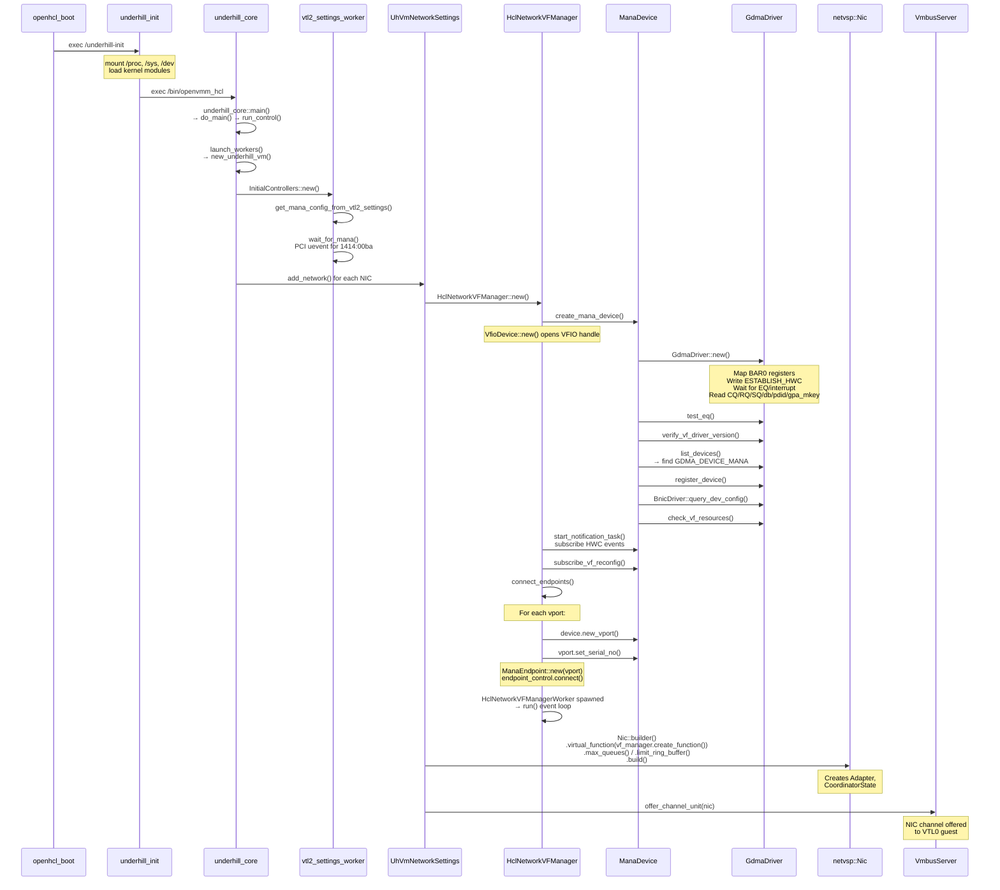
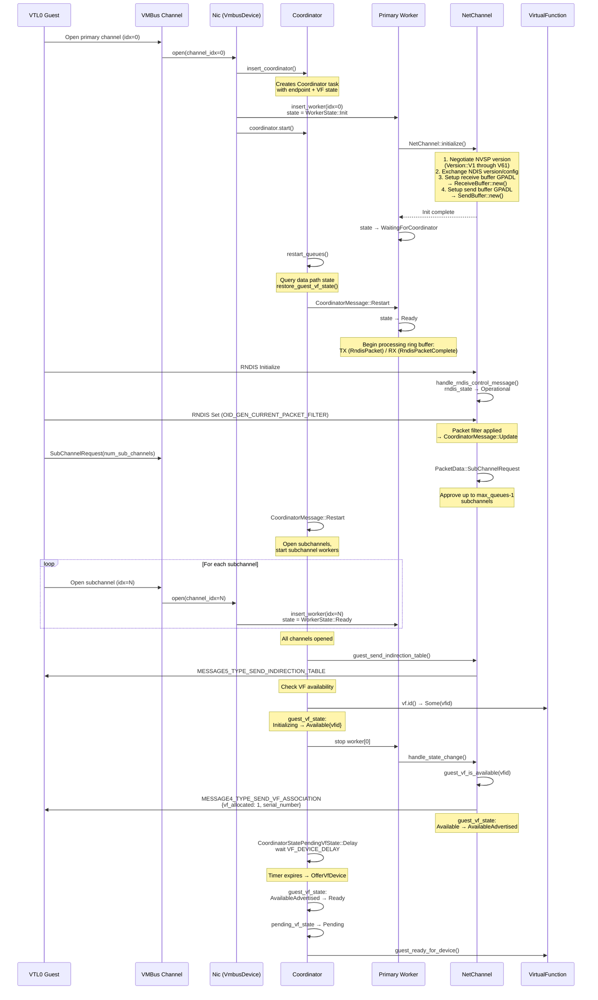
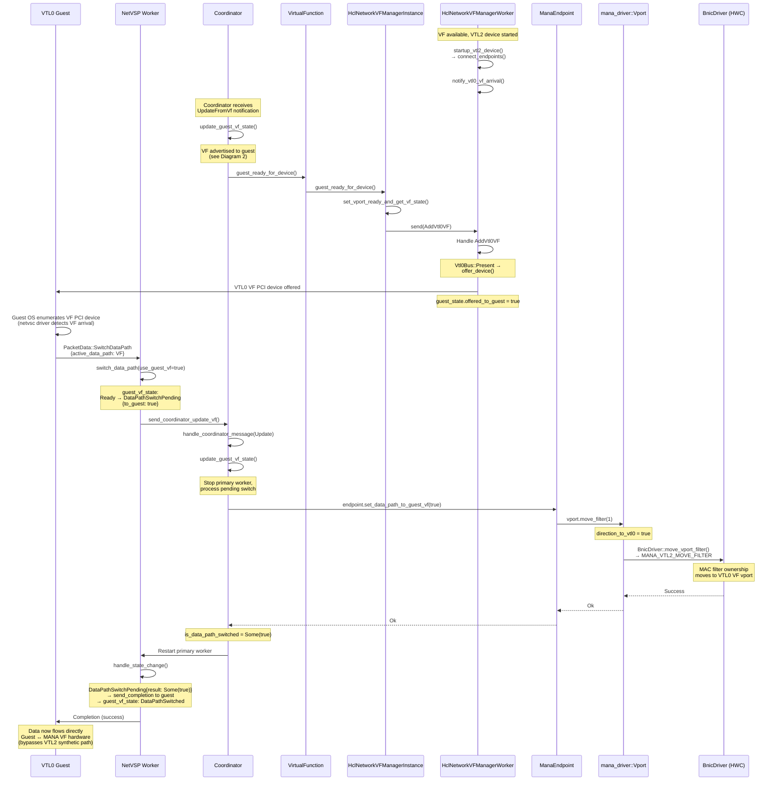
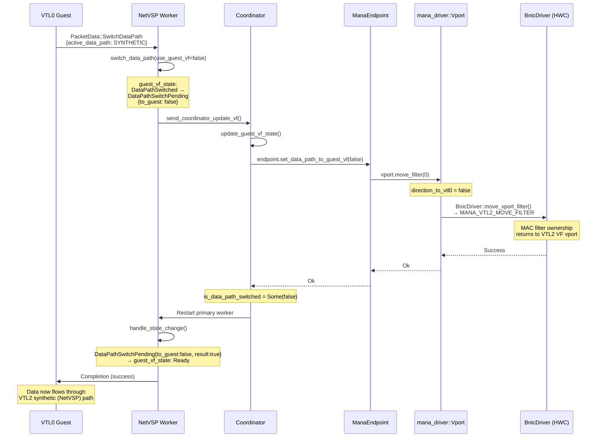
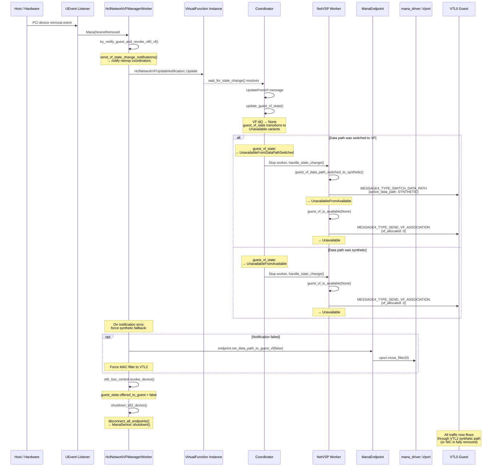
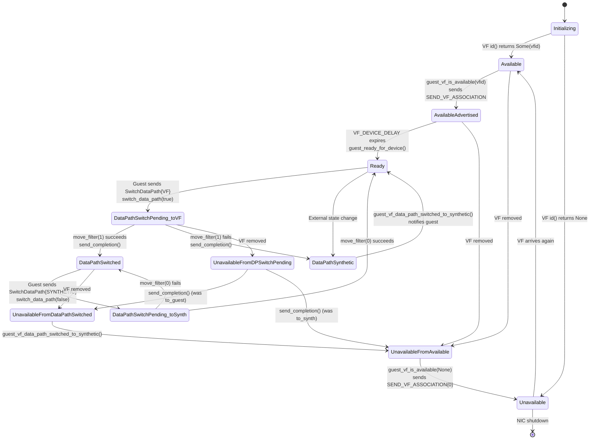

# NetVSP & MANA NIC Lifecycle Diagrams

This document describes the lifecycle of the NetVSP synthetic NIC and the
MANA hardware NIC, from VTL2 boot through VF data-path switching and
teardown. Each diagram calls out the key functions involved.

## 1. VTL2 Startup & MANA Initialization

This diagram shows the boot sequence from the OpenHCL VTL2 entry point
through MANA hardware discovery and the creation of the synthetic NIC
offered to the VTL0 guest.

## 2. Adding a Virtual NIC to the VTL0 Guest

Once the VMBus channel is offered, the VTL0 guest opens it and negotiates
the NVSP protocol, sets up ring buffers and RNDIS, and receives the VF
association advertisement.

## 3. VF Data Path Switch: Synthetic → VF (Accelerated Networking)

When the guest is ready and the VF hardware is available, the data path
switches from the synthetic NetVSP path through VTL2 to direct VF
passthrough to the VTL0 guest.

## 4. VF Data Path Switch Back: VF → Synthetic (Failback)

This can happen due to guest-initiated switchback, VF removal (live
migration, servicing), or hardware reconfiguration. Two sub-flows
are shown.

### 4a. Guest-Initiated Switchback

### 4b. VF Removal / Hardware Reconfiguration (Host-Initiated)

## 5. VF State Machine Summary

The `PrimaryChannelGuestVfState` enum in `netvsp` drives all VF-related
guest interactions. Here is the complete state machine:

## Key Source Locations

| Component | File | Key Functions |
|-----------|------|---------------|
| VTL2 entry | `openhcl/underhill_entry/src/lib.rs` | `underhill_main()` |
| VM worker setup | `openhcl/underhill_core/src/worker.rs` | `new_underhill_vm()`, `add_network()`, `new_underhill_nic()` |
| MANA PCI discovery | `openhcl/underhill_core/src/dispatch/vtl2_settings_worker.rs` | `wait_for_mana()`, `InitialControllers::new()` |
| VF Manager | `openhcl/underhill_core/src/emuplat/netvsp.rs` | `HclNetworkVFManager::new()`, `HclNetworkVFManagerWorker::run()` |
| VF Manager lifecycle | `openhcl/underhill_core/src/emuplat/netvsp.rs` | `startup_vtl2_device()`, `connect_endpoints()`, `shutdown_vtl2_device()` |
| VF Manager guest ops | `openhcl/underhill_core/src/emuplat/netvsp.rs` | `try_notify_guest_and_revoke_vtl0_vf()`, `notify_vtl0_vf_arrival()` |
| MANA driver init | `vm/devices/net/mana_driver/src/mana.rs` | `ManaDevice::new()`, `start_notification_task()` |
| GDMA driver | `vm/devices/net/mana_driver/src/gdma_driver.rs` | `GdmaDriver::new()`, `GdmaDriver::restore()` |
| MANA vport / filter | `vm/devices/net/mana_driver/src/mana.rs` | `Vport::move_filter()`, `Vport::query_filter_state()` |
| MANA endpoint | `vm/devices/net/net_mana/src/lib.rs` | `ManaEndpoint::new()`, `set_data_path_to_guest_vf()` |
| NetVSP NIC | `vm/devices/net/netvsp/src/lib.rs` | `Nic::builder()`, `NicBuilder::build()` |
| NetVSP VMBus device | `vm/devices/net/netvsp/src/lib.rs` | `open()`, `close()`, `start()`, `stop()` |
| NetVSP coordinator | `vm/devices/net/netvsp/src/lib.rs` | `Coordinator::process()`, `update_guest_vf_state()`, `restore_guest_vf_state()` |
| NetVSP worker | `vm/devices/net/netvsp/src/lib.rs` | `Worker::process()`, `handle_state_change()`, `switch_data_path()` |
| NetVSP VF messaging | `vm/devices/net/netvsp/src/lib.rs` | `guest_vf_is_available()`, `guest_vf_data_path_switched_to_synthetic()` |
| NVSP protocol | `vm/devices/net/netvsp/src/protocol.rs` | `Message4SendVfAssociation`, `Message4SwitchDataPath`, `DataPath` |
